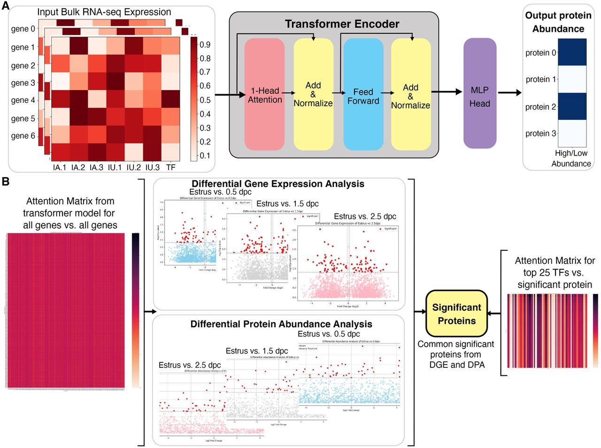

# Mintomics - Integration of Transcriptomics to Proteomics using Transformer



## Overview

**mintomics** is a multi-omics analysis pipeline designed to integrate transcriptomic and proteomic data using a transformer-based model. The objective is to elucidate the adaptive characteristics of the oviduct during natural fertilization, as described in [Finnerty et al., eLife 2025](https://elifesciences.org/articles/100705).

## Methodology

### Biological Context
The oviduct (fallopian tube) is the site of fertilization and preimplantation embryo development in mammals. This project investigates how the presence of gametes and embryos modulates oviductal gene and protein expression, using multi-omics data and advanced machine learning.

### Multi-Omics Integration
- **Transcriptomics**: Bulk RNA-seq data from mouse oviductal tissues at various preimplantation stages.
- **Proteomics**: Protein abundance data from oviductal fluid, comparing natural fertilization and superovulation.
- **Machine Learning**: A transformer-based model integrates transcriptomic and proteomic data to predict protein abundance from gene expression and identify key transcription factors.

For more details, see the [eLife article](https://elifesciences.org/articles/100705).

## Data Sampling & Structure

### Data Sources
- **Gene Expression**: Processed CPM (counts per million) data for different stages:
  - `Data/Data_cpm/Data_control.csv`
  - `Data/Data_cpm/Data_0_5preg.csv`
  - `Data/Data_cpm/Data_1_5preg.csv`
  - `Data/Data_cpm/Data_2_5preg.csv`
- **Protein Labels**: Normalized protein abundance labels:
  - `Data/Labels_proc_log10_minmax/Labels_control.csv`
  - `Data/Labels_proc_log10_minmax/Labels_0_5preg.csv`
  - `Data/Labels_proc_log10_minmax/Labels_1_5preg.csv`
  - `Data/Labels_proc_log10_minmax/Labels_2_5preg.csv`
- **Transcription Factors**: List in `Mouse_TFs1`
- **Differential Data**: Differentially expressed genes and proteins in `Data/Diff_data/` and `Data/Diff_labels/`

### Data Preparation
- Raw data is filtered, normalized (CPM, log, min-max), and split by stage.
- Transcription factors are annotated in the gene list.
- Data loaders sample gene-protein pairs for model training/testing.

## Pipeline Usage

### Requirements
- Python 3.8+
- PyTorch, PyTorch Lightning, pandas, numpy, seaborn, matplotlib, wandb, mlxtend, rnanorm, scipy, torchmetrics

Install dependencies (example):
```bash
pip install torch pytorch-lightning pandas numpy seaborn matplotlib wandb mlxtend rnanorm scipy torchmetrics
```

### Training the Model
Run the following command to train the transformer-based model:
```bash
python Training.py --num_gpus 1 --nodes 1 --num_epochs 100 --batch_size 8 --save_dir tempo
```
- Training and validation data are automatically loaded from the `Dataset/` directory.
- Model checkpoints and logs are saved in `Trainings/`.

### Inference
To run inference on test data using a trained checkpoint:
```bash
python Inference.py --save_dir tempo --chkpt <checkpoint_file.ckpt>
```
- Replace `<checkpoint_file.ckpt>` with the actual checkpoint filename from `Trainings/tempo/`.

### Data Preprocessing
Data preprocessing scripts are provided (see `Data_preprocessing.py`).
- Generates normalized gene and protein data for each stage.
- Example: `python Data_preprocessing.py`

## Output & Analysis
- Model outputs include predicted protein abundances and attention scores for gene-protein relationships.
- Result analysis scripts (e.g., `Result_analysis.py`) help interpret key transcription factors and proteins.
- Visualizations and logs are available via Weights & Biases (wandb).

## Reference
- Finnerty RM, Carulli DJ, Hedge A, et al. (2025). Multi-omics analyses and machine learning prediction of oviductal responses in the presence of gametes and embryos. _eLife_ 13:RP100705. [https://elifesciences.org/articles/100705](https://elifesciences.org/articles/100705)

## License
This project is distributed under the terms of the Creative Commons Attribution License, as per the referenced publication.

