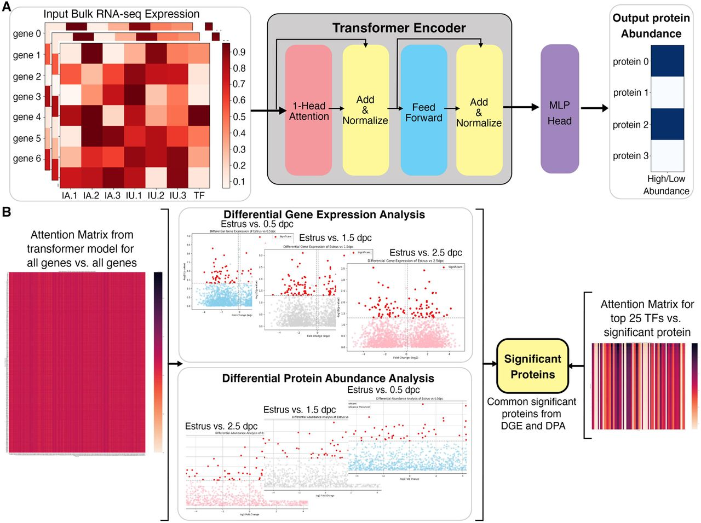

# Mintomics - Integration of Transcriptomics to Proteomics using Transformer



## Overview

**mintomics** is a multi-omics analysis pipeline designed to integrate transcriptomic and proteomic data using a transformer-based model. The objective is to elucidate the adaptive characteristics of the oviduct during natural fertilization, as described in [Finnerty et al., eLife 2025](https://elifesciences.org/articles/100705).

## Methodology

### Biological Context
The oviduct (fallopian tube) is the site of fertilization and preimplantation embryo development in mammals. This project investigates how the presence of gametes and embryos modulates oviductal gene and protein expression, using multi-omics data and advanced machine learning.

### Multi-Omics Integration
- **Transcriptomics**: Bulk RNA-seq data from mouse oviductal tissues at various preimplantation stages.
- **Proteomics**: Protein abundance data from oviductal fluid, comparing natural fertilization and superovulation.
- **Machine Learning**: A transformer-based model integrates transcriptomic and proteomic data to predict protein abundance from gene expression and identify key transcription factors.

For more details, see the [eLife article](https://elifesciences.org/articles/100705).

## Data

Inputs are read from `Dataset/`.

- **Gene expression** (CPM): `Dataset/Data_cpm/Data_control.csv`, `Data_0_5preg.csv`, `Data_1_5preg.csv`, `Data_2_5preg.csv`
- **Protein labels**: `Dataset/Labels_proc_log10_minmax/Labels_control.csv`, `Labels_0_5preg.csv`, `Labels_1_5preg.csv`, `Labels_2_5preg.csv`
- **Transcription-factor symbols**: `Dataset/Mouse_TFs1`, one symbol per line. A gene in the expression table is marked with the TF input flag when its symbol is in this file.
- **Gene-to-protein map**: `Dataset/genetoprotein.csv`
- **Differential inputs**: `Dataset/Collaboration_data.csv`, `Dataset/Labels_orig.csv`, `Dataset/Diff_data/`, `Dataset/Diff_labels/`

Training and validation mask 15% of the mapped gene-protein pairs. Held-out inference uses the pairs unmasked.

## Setup

The pinned environment is Python 3.11 with PyTorch 2.6.0 for CUDA 12.4. From the repository root:

```bash
python3.11 -m venv .venv
source .venv/bin/activate
pip install -r requirements.txt
```

`requirements.txt` includes the PyTorch CUDA 12.4 index and the packages used by training, inference, and the DESeq2 gene list (`lightning`, `torchmetrics`, `pandas`, `pydeseq2`, `rnanorm`, and their dependencies).

## Training

```bash
.venv/bin/python Training.py \
  --num_gpus 1 \
  --nodes 1 \
  --num_epochs 1 \
  --batch_size 1 \
  --abundance_threshold 0.6 \
  --save_dir exprscale_0.6
```

| Argument | Default | Role |
|---|---|---|
| `--num_gpus` | `1` | GPUs used by the trainer |
| `--nodes` | `1` | Machines used by the trainer |
| `--num_epochs` | `1` | Training epochs |
| `--batch_size` | `1` | Batch size |
| `--abundance_threshold` | `0.8` | Protein abundance cutoff for the positive class |
| `--save_dir` | `retrain` | Subdirectory of `Trainings/` for the checkpoint |
| `--learning_rate` | `1e-4` | Optimizer learning rate |
| `--num_dataloader_workers` | `1` | Data-loader workers |

The seed is 42. Checkpoints are written under `Trainings/<save_dir>/`. Use the same `--abundance_threshold` at inference as was used for that checkpoint. Existing runs are `Trainings/exprscale_0.6/` and `Trainings/exprscale_0.8/`.

Set `WANDB_MODE=offline` to keep Weights & Biases from contacting the network.

## Inference

```bash
WANDB_MODE=offline .venv/bin/python Inference.py \
  --timepoint all \
  --abundance_threshold 0.6 \
  --save_dir exprscale_0.6 \
  --chkpt mintomics_epoch=00_valid_loss=0.089202.ckpt
```

| Argument | Default | Role |
|---|---|---|
| `--chkpt` | none | Checkpoint filename inside `Trainings/<save_dir>/`. Required. |
| `--save_dir` | `Trainings/tempo` | Subdirectory of `Trainings/` that contains `--chkpt` |
| `--timepoint` | `2.5` | `0.5`, `1.5`, `2.5`, or `all` |
| `--abundance_threshold` | `0.8` | Positive-class cutoff. Match the checkpoint. |
| `--num_gpus` | `1` | GPUs used by the trainer |

For the 0.8 checkpoint:

```bash
WANDB_MODE=offline .venv/bin/python Inference.py \
  --timepoint 2.5 \
  --abundance_threshold 0.8 \
  --save_dir exprscale_0.8 \
  --chkpt mintomics_epoch=00_valid_loss=0.011100.ckpt
```

## Intermediate files

Inference and the differential-gene script write to `intermediate_files/` at the repository root. They do not replace files in `Dataset/`.

### Top-ranked genes and figures

`Inference.py` writes one set of files per stage. The stage tag is the timepoint with the dot replaced by an underscore (`0_5`, `1_5`, `2_5`).

- `Tfs_allprot_<tag>.csv`: for each mapped protein, the 25 genes with the highest attention. The table has 25 data rows. Gene symbols occupy the first half of the columns and the sigmoid-scaled attention scores occupy the second half, under the same protein headers.
- `inference_confusion_matrix_<tag>.png`: held-out binary confusion matrix at the chosen abundance threshold.
- `inference_attention_<tag>.png`: attention heatmap for the high-abundance proteins.

The top-25 ranking uses every gene in the expression table. It is not limited to `Dataset/Mouse_TFs1`.

### Significant-gene lists

From the repository root:

```bash
.venv/bin/python src/preprocess/Diff_Gene_proc.py
```

The script reads `Dataset/Collaboration_data.csv`, drops genes whose counts sum to less than 10, drops the 3.5 and pseudo samples, and runs DESeq2 for T0.5, T1.5, and T2.5 against the Finnerty control `TC`. Genes kept have adjusted p < 0.05 and absolute log2 fold change > 0.1, and they must map through `Dataset/genetoprotein.csv` to an accession in `Dataset/Labels_orig.csv`.

It writes one symbol per line, without a header:

- `intermediate_files/Siggenebasedprotlist_TCT0.5.csv`
- `intermediate_files/Siggenebasedprotlist_TCT1.5.csv`
- `intermediate_files/Siggenebasedprotlist_TCT2.5.csv`

Those three files are written before the later protein-ranking section. That section imports `protrank`, which is not on the default module path, so the process can exit after the lists have already been saved.

## Output and analysis

- `Result_analysis.py` reads the top-ranked tables and the significant-gene lists.
- Training logs go to Weights & Biases. Use `WANDB_MODE=offline` for a local run.

## Reference
- Finnerty RM, Carulli DJ, Hedge A, et al. (2025). Multi-omics analyses and machine learning prediction of oviductal responses in the presence of gametes and embryos. _eLife_ 13:RP100705. [https://elifesciences.org/articles/100705](https://elifesciences.org/articles/100705)

## License
This project is distributed under the terms of the Creative Commons Attribution License, as per the referenced publication.

